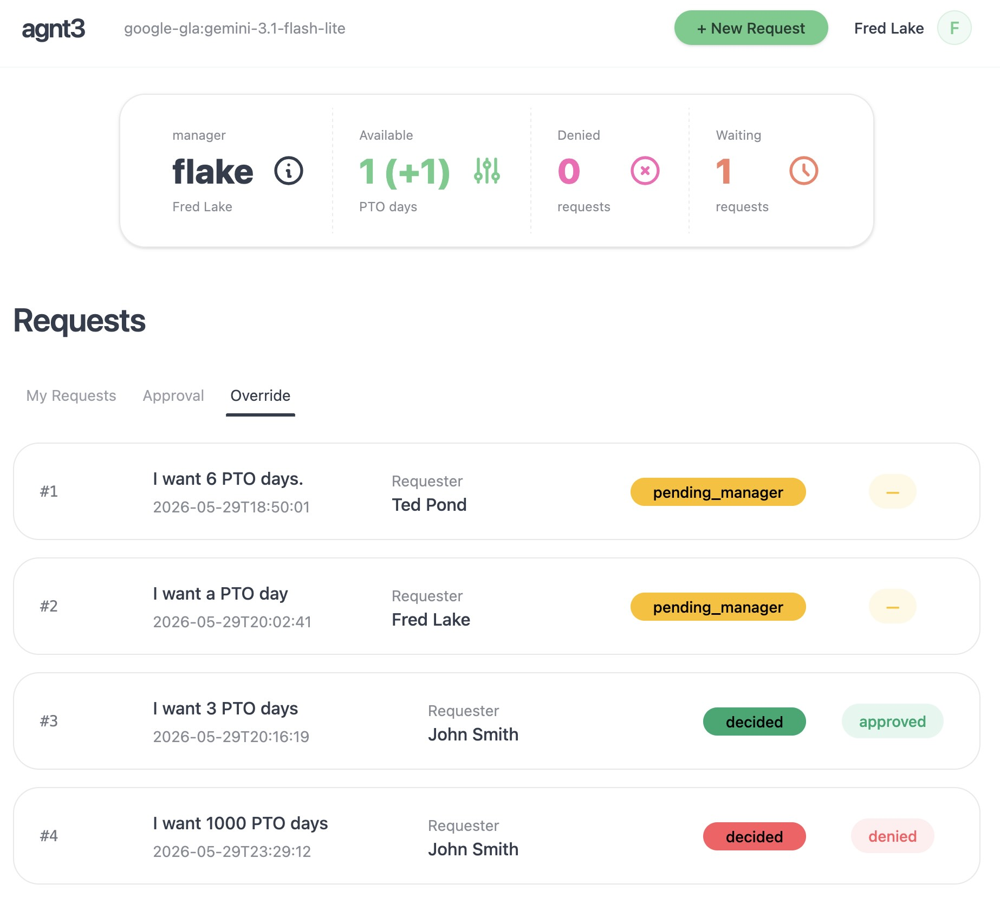
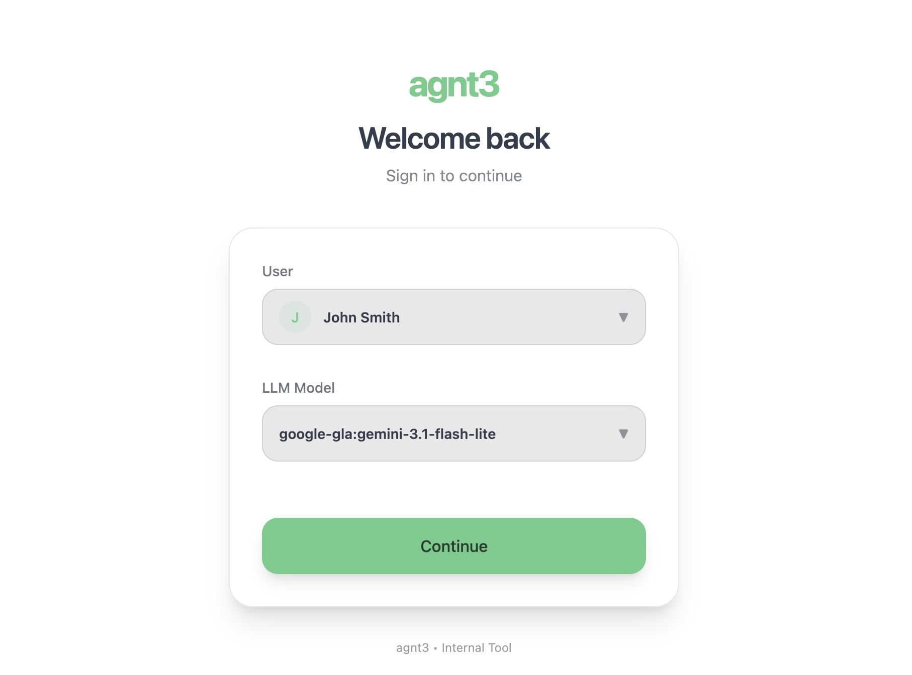
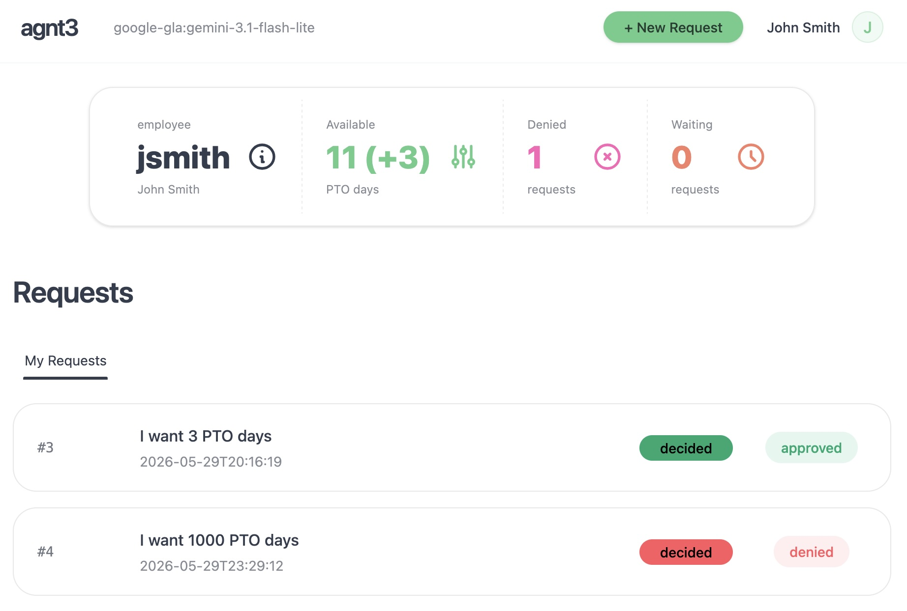
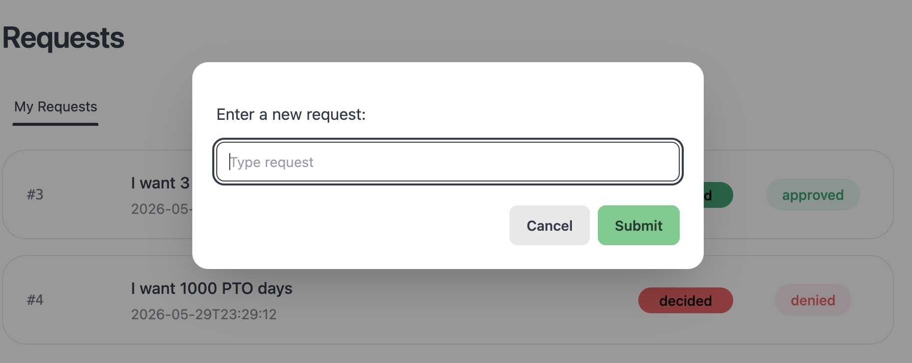
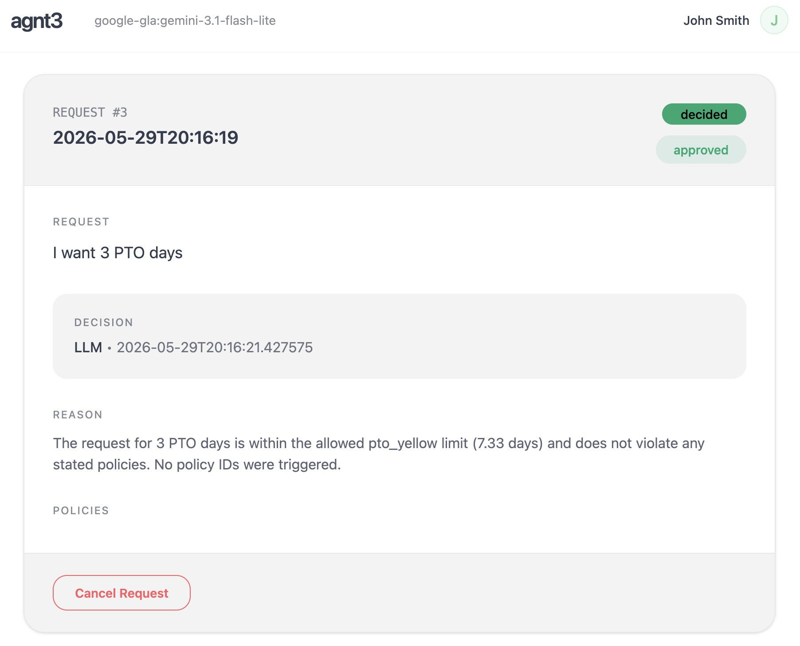
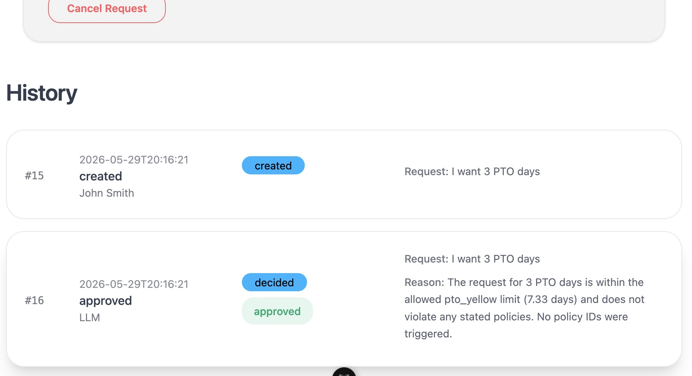
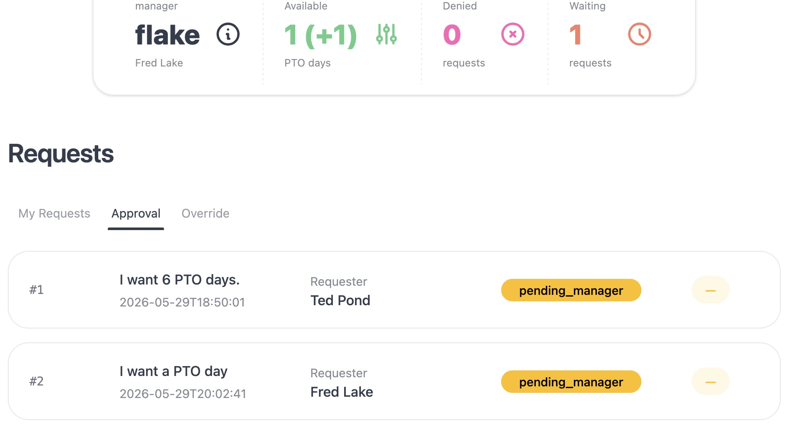
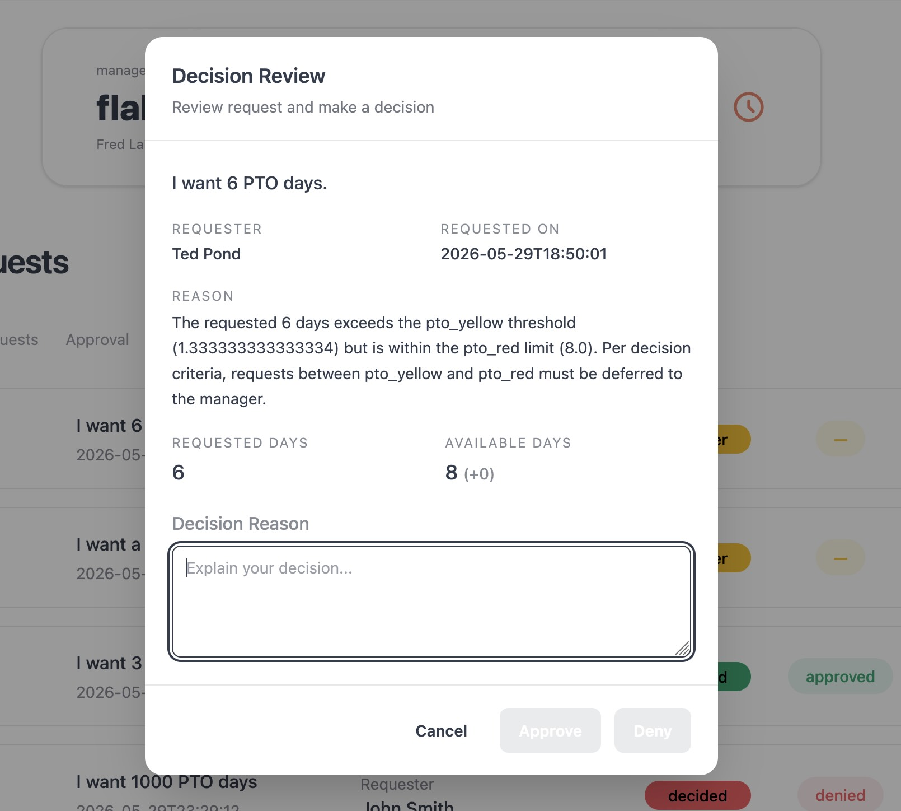
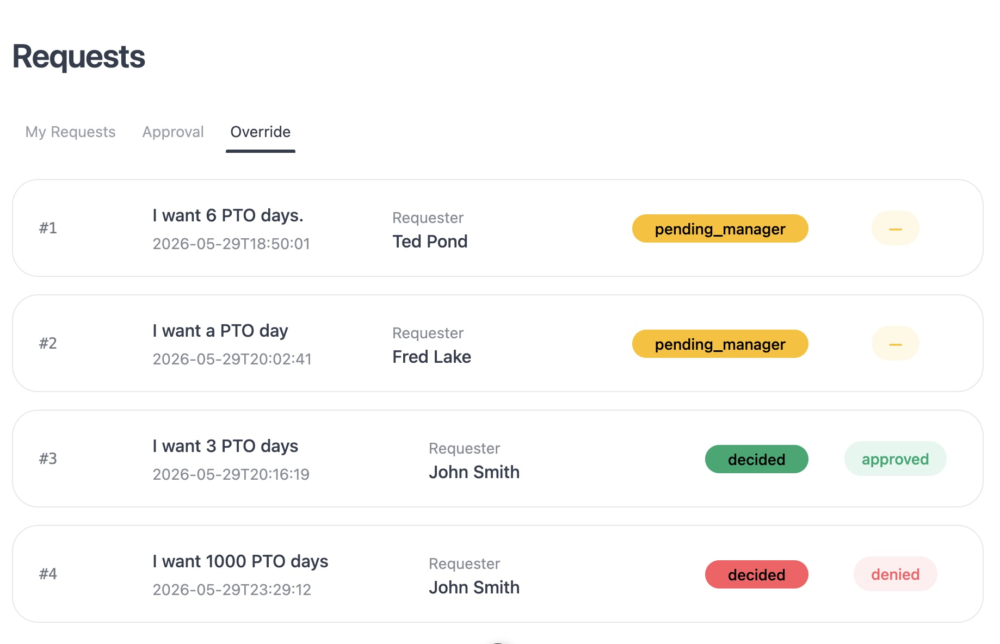

#+TITLE: agnt3 - Sandbox Compliance Officer

AI agent system for HR and compliance automation with Human-in-the-Loop (HITL) gating.  This project explores how LLMs can assist policy-driven business workflows while preserving human authority, auditability, and deterministic state management.

agnt3 is an experimental compliance workflow platform that combines:

- LLM-based policy reasoning
- deterministic backend state management
- human approval and override flows
- audit logging
- runtime-switchable models
- async service orchestration

The project simulates enterprise PTO approval workflows where:

- an LLM evaluates requests against policy
- managers and VPs retain final authority
- all state transitions are auditable
- policy decisions remain reviewable and reversible

The goal is controlled AI-assisted decision making.

#+BEGIN_QUOTE
LLMs may approve, deny, or defer.
Humans may cancel, appeal, approve, deny, or override.
#+END_QUOTE

* Key Features
- PydanticAI agent orchestration
- MCP server integration using streamable-http transport
- FastAPI backend with async SQLAlchemy
- Vue 3 frontend with role-aware dashboard flows
- Runtime LLM switching
- Human-in-the-Loop approval gates
- Full request and decision audit history
- Policy-driven PTO evaluation
- Persistent PTO planned-day tracking
- Async-safe CRUD architecture

* Architecture
#+BEGIN_SRC mermaid
graph TD
    Frontend[Vue 3 Frontend] 
    Backend[FastAPI Backend]
    Agent[PydanticAI Agent]
    Tool[MCP Policy Tool]
    DB[(SQLite / SQLAlchemy Async ORM)]

    Frontend --> Backend
    Backend --> Agent
    Backend --> DB
    Agent --> Tool

    classDef frontend fill:#4f46e5,stroke:#fff,color:#fff
    classDef backend fill:#16a34a,stroke:#fff,color:#fff
    classDef agent fill:#eab308,stroke:#333,color:#333
    classDef db fill:#64748b,stroke:#fff,color:#fff

    class Frontend frontend
    class Backend backend
    class Agent,Tool agent
    class DB db
#+END_SRC

* Key Design Considerations
** Human-in-the-Loop Design
The LLM is intentionally constrained.

The agent can:

- approve requests
- deny requests
- defer requests upward

The agent cannot:

- finalize managerial overrides
- bypass approval chains
- mutate policy
- execute unrestricted actions

Human actors remain authoritative.

This architecture mirrors real enterprise governance patterns where AI assists operational decisions but does not become the system of record authority.

** Why LLM and MCP
In agnt3, PTO policies are not hardcoded into application logic.

Instead, policies are maintained as live human-readable documents in: =policy/pto_policy.md= file.  Example:
#+begin_src 
### POL-002: Blackout Periods
- No PTO may be taken during the **Q4 audit window** (December 1st – December 31st).
- Exceptions are VP approval required
#+end_src

The policy file may be modified by the organization at any time without redeploying the application.

During request evaluation:
- the agent retrieves the latest policy document through MCP
- the LLM reviews the current policy text
- the request is evaluated against the live policy set

This architecture separates:
- policy authoring
- policy retrieval
- policy reasoning
- workflow enforcement

The policies themselves are not programmed as deterministic rules.

Instead, the LLM interprets policies expressed in natural language while the surrounding system constrains execution through Human-in-the-Loop approval gates and deterministic backend state management.

This approach allows rapid policy iteration while preserving operational control and auditability.

* Technology Stack

| Layer    | Technology                                               |
|----------+----------------------------------------------------------|
| Agent    | PydanticAI                                               |
| Models   | Gemini 3.1 Flash Lite / Gemini 2.5 Flash Lite / Qwen3:8b |
| Tooling  | MCP Python SDK                                           |
| Backend  | FastAPI                                                  |
| ORM      | SQLAlchemy Async                                         |
| Database | SQLite + aiosqlite                                       |
| Frontend | Vue 3 + Vite                                             |
| UI       | Tailwind + DaisyUI                                       |
| State    | Pinia                                                    |

* Request Lifecycle
#+BEGIN_SRC mermaid
flowchart TD
    Start[Employee submits PTO request] 
    --> LLM[LLM evaluates request against policy]

    LLM --> Approved[Approved]
    LLM --> Denied[Denied]
    LLM --> DeferredManager[Deferred to Manager]
    LLM --> DeferredVP[Deferred to VP]
    
    DeferredManager --> ManagerApproved[Manager Approved]
    DeferredManager --> ManagerDenied[Manager Denied]
    
    DeferredVP --> VPApproved[VP Approved]
    DeferredVP --> VPDenied[VP Denied]

    %% Additional actions
    subgraph ExtraActions["Additional Actions"]
        Cancelled[Cancelled]
        Appealed[Appealed]
        Resubmitted[Resubmitted]
    end

    %% Styling
    classDef process fill:#3b82f6,stroke:#1e40af,color:white
    classDef decision fill:#eab308,stroke:#854d0e,color:black
    classDef final fill:#22c55e,stroke:#166534,color:white
    classDef extra fill:#8b5cf6,stroke:#4c1d95,color:white

    class Start,LLM process
    class Approved,ManagerApproved,VPApproved final
    class Denied,ManagerDenied,VPDenied decision
    class DeferredManager,DeferredVP decision
    class Cancelled,Appealed,Resubmitted extra
#+END_SRC

** LLM processes
All submitted and re-submitted requests are first processed by LLM.
- LLM is given the carefully crafted system prompt:
#+begin_src 
You are a corporate compliance officer operating within the agnt3 automated system. 
Your job is to read HR requests, cross-reference them against the rules in 'pto_policy.md', and catch violations.

CRITICAL LOGIC PROCESS:
For every request, you must execute your reasoning in this exact order:

1. DENY NON-PTO REQUEST AND STOP: If no specific number of PTO days is being requested, the decision must be denied and mark as 'denied'.  If no number of PTO days is requested, skip steps 2-4 and STOP.
2. RULE BALANCING: Identify ALL policy IDs triggered or violated by the request.
3. EXCEPTION CHECK: For every triggered policy ID, read the text carefully to check if it contains phrases like "VP approval required", "Exceptions are", "review required", or "discretionary". 
   - If ANY triggered policy contains an exceptional or VP approval path, the request CANNOT be flatly denied by you. It MUST be deferred.
4. DECISION CRITERIA:
   - "denied": Only if there is a clear-cut violation AND the policy text provides NO exceptional path or VP override.  Or, requested_days > pto_red days.
   - "approved": Only if there are zero violations AND requested_days <= pto_yellow days.
   - "deferred_to_*": For all other situations. If a policy requires a VP review/approval, set "deferred_to_vp". If it requires a standard review, set "deferred_to_manager".  Also if pto_yellow < requested_days <= pto_red.

Output your final judgment using the requested JSON schema. Be concise. Put requested_days to "requested_days" and cite specific rule text in your "reason".
#+end_src
- LLM is provided the requester's consumed, available and planned PTO days
- LLM uses MCP to obtain the latest PTO policies

The system prompt uses a structured reasoning process and schema-constrained outputs to improve decision consistency across multiple LLMs.

** Other rules (not shown in diagram)
- Requester can appeal LLM-denied requests to human (manager)
- Requester can cancel any of his/her requests
- Denied/canceled requests can be re-submitted
- Manager can override LLM/manager approved/denied/pending requests
- VP can override all approved/denied/pending requests

* PTO Decision Logic

The agent evaluates PTO requests using policy thresholds derived from:

- PTO assigned
- PTO consumed
- PTO already planned

Two thresholds are injected into the prompt context:

- pto_yellow
- pto_red

Decision behavior:

| Condition                              | Result              |
|----------------------------------------+---------------------|
| requested_days <= pto_yellow           | approved            |
| pto_yellow < requested_days <= pto_red | deferred_to_manager |
| requested_days > pto_red               | denied              |

Clear policy violations may also result in denial.

* Runtime Model Switching

Models are selectable at login time.

Current supported models:

- google-gla:gemini-3.1-flash-lite
- google-gla:gemini-2.5-flash-lite
- qwen3:8b

For gemini models, you'll need to set =GEMINI_API_KEY= environment variable.
To get one, visit Google AI Studio at [[https://aistudio.google.com]]
The backend updates the active model at runtime through:

Note that gemini-2.5-flash-lite is too weak to follow the system_prompt.  This is why 3.1-flash-lite is set as the default.

- GET /models
- POST /models/{model_name}

This allows comparative experimentation across model capabilities without redeployment.

* Repo layout
| Path           | Purpose                                              |
|----------------+------------------------------------------------------|
| agent/agent.py | PydanticAI orchestration and runtime model switching |
| api/main.py    | FastAPI endpoints and workflow entrypoints           |
| db/models.py   | SQLAlchemy ORM models and constants                  |
| db/crud.py     | Centralized async mutation logic                     |
| mcp/server.py  | MCP server and policy tool exposure                  |
| policy/        | Markdown policy documents                            |
| fe/src/views/  | Vue application views                                |
| fe/src/stores/ | Pinia state management                               |

The backend intentionally centralizes state mutations inside update_request() to maintain consistent PTO accounting and audit behavior.

* Notable Engineering Problems

** Challenge — PTO Planned-Day Tracking

One of the most important backend problems involved maintaining correct PTO accounting across:

- approvals
- denials
- cancellations
- appeals
- resubmissions
- overrides

The solution required:

- state-transition delta accounting
- audit persistence
- careful handling of SQLAlchemy identity-map behavior
- centralized mutation logic inside update_request()

A major bug was discovered where mutating ORM entities before calling update_request() corrupted previous-state tracking because both references pointed to the same identity-mapped object.

The fix:

- avoid pre-mutation in PATCH handlers
- preserve previous state before mutation
- centralize all request mutation logic

This became the core consistency mechanism of the system.

* Quick Start
** Setup (only once)
- Python 3.14.0 (probably work with 3.11.0 or later)
- Create project
#+begin_src bash
brew install uv  # for mac
git clone https://github.com/achiwa912/agnt3.git
cd agnt3
uv sync
source .venv/bin/activate
#+end_src

- Install local LLM model
#+begin_src bash
ollama run qwen3:8b
#+end_src

- Vue+TailwindCSS+DaisyUI scaffolding
#+begin_src bash
cd fe
pnpm install
pnpm add -D daisyui@latest
pnpm add -D @tailwindcss/vite tailwindcss
pnpm add -g @vue/language-server  # for Emacs
#+end_src

- options to choose
#+begin_src 
TypeScript: No
JSX: No
Vue Router: Yes  # <--- must
Pinia: Yes  # <--- must
Vitest: No
Playwright: No
ESLint: Yes
Prettier: Yes
#+end_src

** Startup

#+BEGIN_SRC bash
# run mcp server (terminal 1)
uv run python mcp/server.py

# delete and initialize database (DESTRUCTIVE!; when you want a fresh start)
rm db/db.db
uv run python -m db.database  # initialize database tables
uv run python -m db.seed  # setup sample users

# run backend (terminal 2)
uvicorn api.main:app --reload --port 8001

# run frontend (terminal 3)
cd fe
pnpm dev
#+END_SRC

*** Sample users
| Username | Role     |
|----------+----------|
| jsmith   | Employee |
| tpond    | Employee |
| flake    | Manager  |
| jbond    | Manager  |
| tgold    | VP       |

** Navigate
- visit login page at http://localhost:5173 from your browser

- Choose a user and optionally an LLM model to login
  - authentication not supported
- You'll see requests (if already exist)

- Click =+ New request button=
- You can create a PTO request (eg, "I want to have 3 PTO days")

- The request is processed by LLM
  - Either approved, denied or pending_manager/vp

- If you click a request in the list, you'll see a detailed page

- The page shows history of all actions (eg, created, approved, etc.)

- You can cancel request or edit request text and re-submit
  - Re-submitted request goes through LLM process (again)

- If logged in as a manager or vp, you'll see approval/override tabs
- Approval tab shows you requests that need your approval

- You can click a request and review the request

- Override tab shows you requests that you can override decisions

** Config
- To change (sample) users
  - edit db/seed.py
- To change policy
  - edit policy/pto_policy.md
- To change system_prompt for LLM
  - change system_prompt in agent/agent.py
- To change LLM models
  - change llm_models in agent/agent.py

* Ports

| Service | Port |
|---------+------|
| MCP Server | 8000 |
| FastAPI | 8001 |
| Vite Frontend | 5173 |

* Findings
- Ambiguous human inputs tend to cause LLM hallucinations
  - It was quite challenging to make LLM behave deterministic for ambiguous human inputs.  I needed to analyze many times why LLM hallucinates for particular requests and to update the system_prompt accordingly.
  - This is why Human-In-The-Loop is important.
- Weak model can be too weak
  - Initially, I wanted to use "cheap" =gemini-2.5-flash-lite= model, but it continued to hallucinate to the point updating system_prompt can't set proper guardrails.  I needed a smarter model (eg, 3.1-flash-lite) for this project.
- Deterministic state is harder than LLM integration
  - Integrating an LLM into the workflow was relatively straightforward.
  - Maintaining correct PTO accounting across approvals, denials, appeals, cancellations, resubmissions, and overrides proved significantly more challenging.
  - Most implementation complexity ultimately came from state-transition correctness, auditability, and data consistency rather than from the LLM itself.

* Future Work

- Auditor mode
- Expanded policy engine
- Multi-policy evaluation
- Additional MCP tools
- Better observability
- Containerized deployment
- Integration testing
- Prompt/version tracking
- Role-based authentication and authorization

* License
Apache 2.0 (see https://www.apache.org/licenses/LICENSE-2.0.txt)
